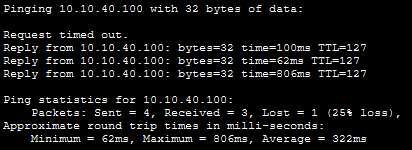
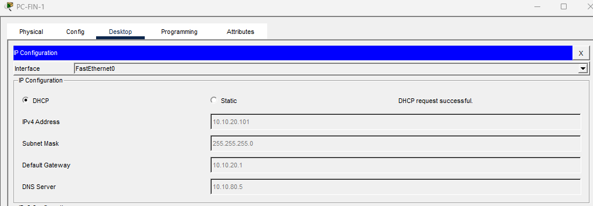
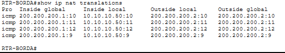
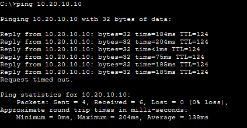
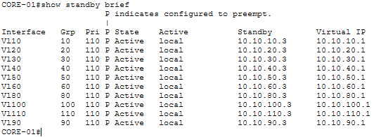
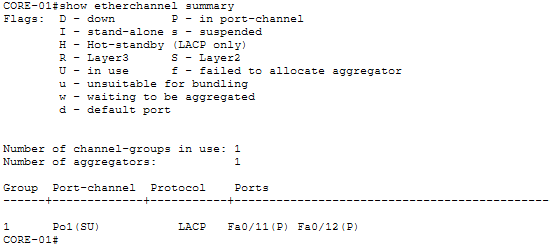
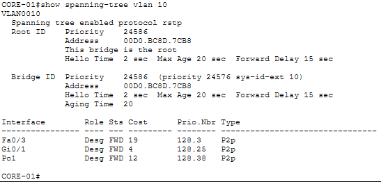
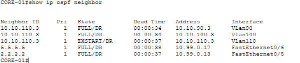

# 1. Visão Geral do Projeto

Projeto avançado de infraestrutura de rede corporativa de alta disponibilidade, implementado no **Cisco Packet Tracer**.

Empresa fictícia **Nuvexa Tecnologia** — Matriz em São Paulo (6 andares, ~150 usuários) e Filial em Guarulhos (3 andares, ~60 usuários), interligadas por WAN, com acesso à Internet, Data Center, DMZ, Wi-Fi, VoIP, redundância, segurança e monitoramento.

## Topologia física

Disposição (da esquerda para a direita): a **borda** (SRV-WEB-DMZ, INTERNET, RTR-BORDA) conecta o **núcleo** (CORE-01 e CORE-02, interligados por EtherChannel). Do núcleo descem os **switches de acesso** da Matriz (SW-AND1 a SW-AND6) com PCs, telefones IP, Access Points e servidores. À direita, a **WAN** (RTR-WAN-SP → RTR-WAN-GRU) conecta a **Filial** (SW-FIL-L3 com SW-FIL-A1/A2/A3 e seus PCs).

O diagrama físico completo está disponível na pasta `DIAGRAMS/physical-topology.png`.

## Arquitetura hierárquica (Core / Distribution / Access)

- **Core (CORE-01 / CORE-02):** switches multilayer 3560, fazem roteamento InterVLAN, HSRP (gateways virtuais) e são interligados por EtherChannel LACP. CORE-01 é o Root Bridge do STP.
- **Access (SW-AND1..6):** switches 2960, um por andar, com portas de acesso, voice VLAN e trunks redundantes para os dois Core.
- **Filial:** SW-FIL-L3 (3560) faz o roteamento local; SW-FIL-A1..3 (2960) são o acesso por andar.
- **Borda/WAN:** RTR-BORDA faz NAT/PAT e DMZ; RTR-WAN-SP e RTR-WAN-GRU formam a WAN entre as cidades.

## Tecnologias implementadas

| Área | Implementação |
|------|---------------|
| Switching / VLAN | 14 VLANs, trunks 802.1Q, VLAN nativa 999, voice VLAN |
| Redundância L2 | Rapid PVST+, Root Bridge (CORE-01), Secondary (CORE-02), PortFast, BPDU Guard |
| Agregação | EtherChannel LACP (Po1) entre os Core |
| Redundância L3 | HSRP v2 (gateway virtual em cada VLAN) |
| Roteamento | InterVLAN (SVI) + OSPF Multi-Area (Area 0, 10, 20) |
| WAN | Enlace SP - GRU roteado por OSPF |
| Endereçamento | IPv4 com VLSM (/24, /27, /28, /30) |
| Serviços | DHCP centralizado + DHCP Relay, DNS interno, NTP, Syslog |
| Borda | NAT/PAT (overload), DMZ |
| Segurança | ACLs (5 regras), Port Security (sticky), SSH v2, banner, senhas |
| Wireless | Wi-Fi corporativo (VLAN 100) e visitantes (VLAN 110) |
| Voz | VoIP com Data VLAN + Voice VLAN (VLAN 90) |

## Credenciais de acesso (equipamentos de rede)

| Tipo | Valor |
|------|-------|
| Usuário (SSH/login local) | admin / Nuvexa@2026 |
| Enable secret | Nuvexa@Enable |
| Console | Nuvexa@Con |

Acesso remoto **somente por SSH v2** (Telnet desabilitado). Banner de acesso restrito em todos os equipamentos.

## Checklist do desafio

Topologia hierárquica; 6 andares Matriz + 3 Filial; 14 VLANs; endereçamento VLSM; trunks 802.1Q; InterVLAN routing; HSRP com teste de falha; STP Rapid PVST+ (Root Bridge, PortFast, BPDU Guard); EtherChannel LACP; OSPF Multi-Area; WAN; DHCP + Relay; DNS; NTP; Syslog; NAT/PAT; DMZ; ACLs (5 regras); Port Security; SSH + banner + senhas; Wi-Fi corp/guest; VoIP; 10 testes obrigatórios; documentação e evidências. **Todos concluídos.**

# 2. Plano de VLANs

## Tabela de VLANs

| VLAN | Nome | Departamento / Função | Localização |
|------|------|-----------------------|-------------|
| 10 | ADMIN | Administrativo | Matriz 1º / 5º andar |
| 20 | FINANCE | Financeiro | Matriz 2º andar |
| 30 | HR | Recursos Humanos | Matriz 2º andar |
| 40 | DEV | Desenvolvimento | Matriz 3º andar |
| 50 | QA | Qualidade | Matriz 3º andar |
| 60 | IT | Tecnologia da Informação | Matriz 4º andar |
| 70 | MANAGEMENT | Gerenciamento dos equipamentos | Todos |
| 80 | SERVERS | Servidores | Data Center (6º andar) |
| 90 | VOICE | Telefonia IP (VoIP) | Todos os andares |
| 100 | WIFI-CORP | Wi-Fi corporativo | Todos os andares |
| 110 | WIFI-GUEST | Wi-Fi visitantes | Todos os andares |
| 120 | CCTV | Câmeras de segurança | Todos os andares |
| 130 | IOT | Dispositivos IoT | Todos os andares |
| 999 | BLACKHOLE | Portas não utilizadas | Todos os switches |

## VLANs da Filial

| VLAN | Nome | Função |
|------|------|--------|
| 210 | FIL-ADMIN | Atendimento / Administrativo (1º andar) |
| 220 | FIL-FINANCE | Financeiro / Operações (2º andar) |
| 230 | FIL-OPS | TI / Servidores (3º andar) |

## Configuração das VLANs

```
vlan 10
 name ADMIN
vlan 20
 name FINANCE
... (demais VLANs 30 a 130)
vlan 999
 name BLACKHOLE
```

## Trunks 802.1Q

Todos os enlaces entre switches usam trunk 802.1Q com VLAN nativa 999 (proteção contra VLAN hopping), allowed vlan restrito ao necessário e encapsulation dot1q nos 3560.

```
interface gigabitEthernet0/1
 switchport trunk encapsulation dot1q
 switchport mode trunk
 switchport trunk native vlan 999
 switchport trunk allowed vlan 10,90,100,110,999
```

## Portas de acesso (Data VLAN + Voice VLAN) e portas não usadas

```
interface fastEthernet0/1
 switchport mode access
 switchport access vlan 10       ! dados (PC)
 switchport voice vlan 90        ! voz (telefone IP)
 spanning-tree portfast
 spanning-tree bpduguard enable
!
interface range fastEthernet0/3 - 24
 switchport mode access
 switchport access vlan 999      ! portas livres no blackhole
 shutdown
```

# 3. Plano de Endereçamento IP

## Estratégia geral

- **Matriz:** bloco 10.10.0.0/16 — cada VLAN recebe uma sub-rede própria.
- **Filial:** bloco 10.20.0.0/16 — redes separadas da Matriz.
- **Enlaces roteador-a-roteador:** 10.99.0.0/x com máscara /30.
- **DMZ:** 172.16.1.0/29. **Internet simulada:** 200.200.200.0/30.
- **Convenção:** o 3º octeto acompanha a VLAN (VLAN 10 -> 10.10.10.0). Gateway = .1 (IP virtual HSRP); CORE-01 = .2, CORE-02 = .3.

## Tabela de endereçamento — MATRIZ (10.10.0.0/16)

| VLAN | Nome | Rede | Máscara | CIDR | Gateway | Faixa | Broadcast | Hosts |
|------|------|------|---------|------|--------|-------|-----------|-------|
| 10 | ADMIN | 10.10.10.0 | 255.255.255.0 | /24 | 10.10.10.1 | .2-.254 | .255 | 254 |
| 20 | FINANCE | 10.10.20.0 | 255.255.255.0 | /24 | 10.10.20.1 | .2-.254 | .255 | 254 |
| 30 | HR | 10.10.30.0 | 255.255.255.224 | /27 | 10.10.30.1 | .2-.30 | .31 | 30 |
| 40 | DEV | 10.10.40.0 | 255.255.255.0 | /24 | 10.10.40.1 | .2-.254 | .255 | 254 |
| 50 | QA | 10.10.50.0 | 255.255.255.224 | /27 | 10.10.50.1 | .2-.30 | .31 | 30 |
| 60 | IT | 10.10.60.0 | 255.255.255.224 | /27 | 10.10.60.1 | .2-.30 | .31 | 30 |
| 70 | MANAGEMENT | 10.10.70.0 | 255.255.255.224 | /27 | 10.10.70.1 | .2-.30 | .31 | 30 |
| 80 | SERVERS | 10.10.80.0 | 255.255.255.240 | /28 | 10.10.80.1 | .2-.14 | .15 | 14 |
| 90 | VOICE | 10.10.90.0 | 255.255.255.0 | /24 | 10.10.90.1 | .2-.254 | .255 | 254 |
| 100 | WIFI-CORP | 10.10.100.0 | 255.255.255.0 | /24 | 10.10.100.1 | .2-.254 | .255 | 254 |
| 110 | WIFI-GUEST | 10.10.110.0 | 255.255.255.0 | /24 | 10.10.110.1 | .2-.254 | .255 | 254 |
| 120 | CCTV | 10.10.120.0 | 255.255.255.224 | /27 | 10.10.120.1 | .2-.30 | .31 | 30 |
| 130 | IOT | 10.10.130.0 | 255.255.255.224 | /27 | 10.10.130.1 | .2-.30 | .31 | 30 |

## IPs reais dos Core (HSRP) e Filial

Cada VLAN da Matriz tem IP virtual .1 (gateway), CORE-01 com .2 (priority 110, Active) e CORE-02 com .3 (priority 100, Standby), preempt habilitado. A Filial usa gateway .1 real no SW-FIL-L3: 10.20.10.1, 10.20.20.1 e 10.20.30.1 (todas /27).

## Enlaces ponto-a-ponto (/30)

| Enlace | Rede | Lado A | Lado B |
|--------|------|--------|--------|
| WAN: SP - GRU | 10.99.0.0/30 | RTR-WAN-SP 10.99.0.1 | RTR-WAN-GRU 10.99.0.2 |
| CORE-01 - RTR-WAN-SP | 10.99.0.12/30 | RTR-WAN-SP 10.99.0.13 | CORE-01 10.99.0.14 |
| RTR-WAN-GRU - SW-FIL-L3 | 10.99.1.0/30 | RTR-WAN-GRU 10.99.1.1 | SW-FIL-L3 10.99.1.2 |
| CORE-01 - RTR-BORDA | 10.99.0.16/30 | RTR-BORDA 10.99.0.17 | CORE-01 10.99.0.18 |

## DMZ, Internet e faixas DHCP

DMZ 172.16.1.0/29 (gateway 172.16.1.1; SRV-WEB-DMZ 172.16.1.2). Internet 200.200.200.0/30 (RTR-BORDA 200.200.200.1; INTERNET 200.200.200.2). O SRV-DHCP (10.10.80.4) distribui pools para todas as VLANs (início .100 nas /24 e .10 nas /27), com DNS 10.10.80.5, entregues via DHCP Relay (`ip helper-address 10.10.80.4`) nas SVIs dos Core.

## Justificativa do subnetting (VLSM)

- **/24 (254 hosts):** VLANs grandes ou de alto crescimento (ADMIN, FINANCE, DEV, VOICE, Wi-Fi). Wi-Fi e voz têm muitos dispositivos e demanda variável.
- **/27 (30 hosts):** departamentos médios (HR, QA, IT, MANAGEMENT, CCTV, IOT e filial).
- **/28 (14 hosts):** SERVERS — sub-rede pequena facilita controle por ACL.
- **/30 (2 hosts):** enlaces roteador-a-roteador (só 2 pontas). Como as bases são /16, há amplo espaço para expansão futura.

# 4. Tabela de Equipamentos

## Matriz e Filial

| Equipamento | Modelo | Função | IP gerência/principal |
|-------------|--------|--------|----------------------------|
| CORE-01 | 3560-24PS | Core L3, InterVLAN, HSRP Active, Root Bridge | 10.10.70.2 |
| CORE-02 | 3560-24PS | Core L3, HSRP Standby, Secondary Root | 10.10.70.3 |
| SW-AND1..6 | 2960 | Access por andar (1º ao 6º) | 10.10.70.11..16 |
| RTR-BORDA | 2911 | Borda, NAT/PAT, DMZ | 10.99.0.17 |
| RTR-WAN-SP | 2911 | WAN lado Matriz | 10.99.0.1 / .13 |
| RTR-WAN-GRU | 2911 | WAN lado Filial | 10.99.0.2 / 10.99.1.1 |
| SW-FIL-L3 | 3560-24PS | Core/roteamento da Filial | 10.99.1.2 |
| SW-FIL-A1..3 | 2960 | Access por andar (Filial) | — |

## Servidores, OSPF e Wi-Fi

| Servidor | IP | Serviços |
|----------|-----|----------|
| SRV-DHCP | 10.10.80.4 | DHCP + NTP |
| SRV-DNS | 10.10.80.5 | DNS + Syslog |
| SRV-WEB-DMZ | 172.16.1.2 | Web (HTTP) na DMZ |
| INTERNET | 200.200.200.2 | Host externo simulado |

Router IDs OSPF: CORE-01 = 1.1.1.1 (Area 0+10); RTR-WAN-SP = 2.2.2.2 (Area 0); RTR-WAN-GRU = 3.3.3.3 (Area 0+20); SW-FIL-L3 = 4.4.4.4 (Area 20); RTR-BORDA = 5.5.5.5 (Area 0, default-information originate).

SSIDs Wi-Fi: **NUVEXA-CORP** (VLAN 100, funcionários, acesso completo) e **NUVEXA-GUEST** (VLAN 110, visitantes, somente Internet).

# 5. Segurança

## 5.1 ACLs

ACLs estendidas e nomeadas, aplicadas nas SVIs dos dois Core (por causa do HSRP). Ordem: de cima para baixo, para na primeira que combina.

**Regra 1 — Guest (VLAN 110) não acessa redes internas:**
```
ip access-list extended GUEST-RESTRITO
 permit ip 10.10.110.0 0.0.0.255 host 10.10.110.1
 permit udp 10.10.110.0 0.0.0.255 host 10.10.80.4 eq 67
 permit udp 10.10.110.0 0.0.0.255 host 10.10.80.5 eq 53
 deny   ip 10.10.110.0 0.0.0.255 10.10.0.0 0.0.255.255
 deny   ip 10.10.110.0 0.0.0.255 10.20.0.0 0.0.255.255
 deny   ip 10.10.110.0 0.0.0.255 172.16.1.0 0.0.0.7
 permit ip 10.10.110.0 0.0.0.255 any
interface vlan 110
 ip access-group GUEST-RESTRITO in
```

**Regra 2 — Gerenciamento (VLAN 70) só pela TI (VLAN 60):**
```
ip access-list extended PROTEGE-MGMT
 permit ip 10.10.60.0 0.0.0.31 10.10.70.0 0.0.0.31
 deny   ip any 10.10.70.0 0.0.0.31
 permit ip any any
interface vlan 70
 ip access-group PROTEGE-MGMT out
```

**Regra 3 — Financeiro (20) não acessa Dev (40):**
```
ip access-list extended FIN-BLOQUEIA-DEV
 deny   ip 10.10.20.0 0.0.0.255 10.10.40.0 0.0.0.255
 permit ip any any
interface vlan 20
 ip access-group FIN-BLOQUEIA-DEV in
```

**Regras 4 e 5 — Servidores (80) com acesso controlado:**
```
ip access-list extended CONTROLA-SERVERS
 permit tcp 10.10.0.0 0.0.255.255 10.10.80.0 0.0.0.15 eq 80
 permit tcp 10.10.0.0 0.0.255.255 10.10.80.0 0.0.0.15 eq 53
 permit udp 10.10.0.0 0.0.255.255 10.10.80.0 0.0.0.15 eq 53
 permit udp 10.10.0.0 0.0.255.255 10.10.80.0 0.0.0.15 eq 67
 permit icmp 10.10.0.0 0.0.255.255 10.10.80.0 0.0.0.15
 deny   ip 10.10.110.0 0.0.0.255 10.10.80.0 0.0.0.15
 permit ip any any
interface vlan 80
 ip access-group CONTROLA-SERVERS out
```

Resumo: (1) Guest só Internet; (2) só TI acessa gerência; (3) Financeiro não acessa Dev; (4) corporativo acessa serviços autorizados; (5) rede de servidores controlada.

**Evidência — ACL bloqueando o tráfego não autorizado (Teste 3/4):**



## 5.2 Port Security

```
interface range fastEthernet0/1 - 2
 switchport mode access
 switchport port-security
 switchport port-security maximum 2          ! 1 nos switches de servidores
 switchport port-security mac-address sticky
 switchport port-security violation shutdown
```
maximum 2 (PC + telefone); sticky (aprende o MAC); violation shutdown (err-disabled se dispositivo não autorizado conectar). Recuperação: `shutdown` + `no shutdown`.

## 5.3 Hardening (SSH, senhas, banner)

Aplicado em todos os switches e roteadores: `ip domain-name`, `username admin secret`, `enable secret`, `crypto key generate rsa` (1024), `ip ssh version 2`, VTY apenas SSH (`transport input ssh`, Telnet desabilitado), `service password-encryption` e banner MOTD de acesso restrito.

# 6. Serviços de Rede (DHCP, DNS, NAT)

## DHCP centralizado + Relay

O SRV-DHCP (10.10.80.4) distribui IP/máscara/gateway/DNS para todas as VLANs. As SVIs dos Core usam `ip helper-address 10.10.80.4` para encaminhar o pedido entre VLANs.

**Evidência — PC recebendo IP automaticamente via DHCP:**



## DNS interno

O SRV-DNS (10.10.80.5) resolve nomes internos: dns.nuvexa.local, web.nuvexa.local, files.nuvexa.local, monitor.nuvexa.local.

## NAT/PAT (Overload) na borda

O RTR-BORDA traduz os endereços privados para o endereço público (200.200.200.1) com PAT, permitindo que vários hosts compartilhem o mesmo IP público.

```
access-list 1 permit 10.10.0.0 0.0.255.255
access-list 1 permit 10.20.0.0 0.0.255.255
ip nat inside source list 1 interface gigabitEthernet0/1 overload
```

**Evidência — traduções NAT/PAT ativas:**



# 7. Testes Obrigatórios

## Os 10 testes

| # | Teste | Ação | Esperado | Status |
|---|-------|------|----------|--------|
| 1 | PC Adm -> Gateway | ping 10.10.10.1 | Sucesso | OK |
| 2 | PC Fin -> Servidor | ping 10.10.80.5 | Sucesso | OK |
| 3 | PC Fin -> Dev | ping 10.10.40.100 | Bloqueado (ACL) | OK |
| 4 | Guest -> Servidor | ping 10.10.80.5 | Bloqueado (ACL) | OK |
| 5 | Matriz -> Filial | ping 10.20.10.10 | Sucesso (WAN/OSPF) | OK |
| 6 | PC -> Internet | ping 200.200.200.2 | Sucesso (NAT) | OK |
| 7 | Desligar CORE principal | shutdown Vlan CORE-01 | HSRP mantém gateway | OK |
| 8 | Desligar link EtherChannel | shutdown Fa0/11 | Segue pelo link restante | OK |
| 9 | Desligar link L2 redundante | shutdown trunk | STP reconverge sem loop | OK |
| 10 | Vizinhança OSPF | show ip ospf neighbor | Vizinhos FULL | OK |

## Evidências dos testes

**Teste 5/6 — Conectividade Matriz para Filial e PC para Internet:**



**Teste 7 — HSRP: CORE-02 assume o gateway quando o CORE-01 cai:**



**Teste 8 — EtherChannel LACP operacional (Po1 in Use):**



**Teste 9 — STP: CORE-01 como Root Bridge (Rapid PVST+):**



**Teste 10 — OSPF: vizinhança estabelecida (FULL):**



# 8. Desafio de Troubleshooting (10 falhas)

Cada falha com problema, sintoma, comandos, causa, correção e resultado.

**1. VLAN removida do trunk** — PCs perdem o gateway. `show interfaces trunk`. Correção: `switchport trunk allowed vlan add 10`. Resolvido.

**2. Gateway incorreto** — host não sai da rede local. `ipconfig`. Correção: gateway = .1 (HSRP) ou DHCP. Resolvido.

**3. ACL incorreta** — VLAN perde acesso, inclusive ao gateway. `show access-lists`. Correção: permits específicos antes dos deny. Resolvido.

**4. OSPF incorreto** — vizinhança não forma. `show ip ospf neighbor`. Correção: corrigir a área no network. Resolvido.

**5. Interface desligada** — segmento sem comunicação. `show ip interface brief`. Correção: `no shutdown`. Resolvido.

**6. DHCP Relay incorreto** — host em APIPA (169.254.x.x). Correção: `ip helper-address 10.10.80.4` na SVI. Resolvido.

**7. EtherChannel inconsistente** — canal não sobe. `show etherchannel summary`. Correção: igualar LACP active e trunk nos dois lados. Resolvido.

**8. VLAN errada na porta** — PC não pega DHCP. `show vlan brief`. Correção: `switchport access vlan 10`. Resolvido.

**9. Rota ausente** — destino inalcançável. `show ip route`. Correção: adicionar o network na área certa. Resolvido.

**10. NAT incorreto** — sem Internet. `show ip nat translations`. Correção: inside/outside corretos + rede na ACL do NAT. Resolvido.

## Lições aprendidas (problemas reais resolvidos)

1. **HSRP travado (Speak/Listen):** mac-address fixo herdado nas SVIs do 3560. Solução: `no mac-address`.
2. **Loop de camada 2:** enlaces duplicados sem agregação. Solução: Root Bridge (Rapid PVST+) + EtherChannel LACP.
3. **EtherChannel em portas erradas:** portas para switches diferentes derrubam trunks. Solução: confirmar que ligam o mesmo par de equipamentos.
4. **Config no equipamento errado:** SVIs de Core num switch de acesso geram IP duplicado. Solução: remover interfaces indevidas.
5. **DHCP em VLAN sem gateway:** SVI/helper ausente derruba o host em APIPA. Solução: criar SVI com HSRP + helper-address.

Dica validada: testar sempre a partir de um PC/host (com IP completo), não de switches de acesso L2.

---

*Documento gerado para o projeto Nuvexa Corporate Network — Cisco Packet Tracer.*
